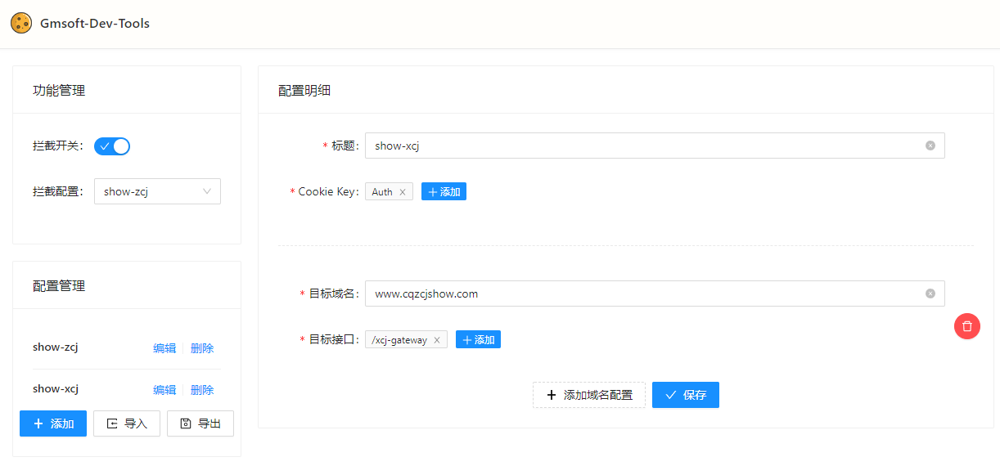
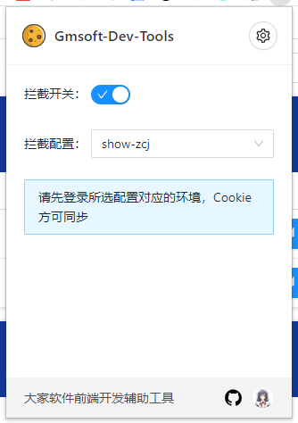
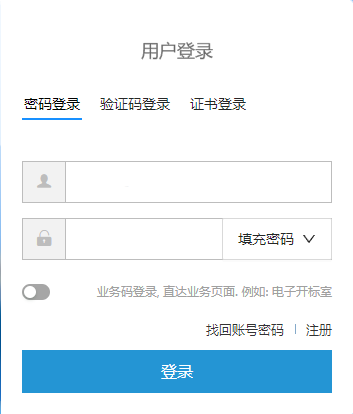
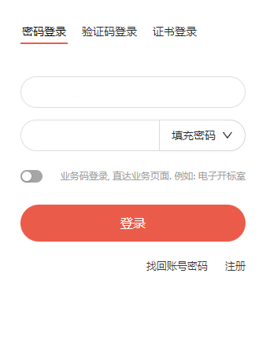

# Gmsoft Dev Tools

大家软件前端开发调试工具，辅助开发环境完成 Cookie 与目标代理环境的同步

## 安装

下载 Release 压缩文件，解压后直接在浏览器中添加已解压的扩展程序即可

_Tips:为什么不发布到商店？没钱！开发者账号要一次性支付 5 USD，我不配。_

## 使用

**注意：仅适用于 localhost、locahost:\*域名的站点，其他域名站点不适用**

1. 安装完成后点击拓展，打开弹层，点击右上角的“设置”按钮，打开设置页

2. 在设置页“配置管理”中点击“添加”

3. 配置明细："Cookie Key"代表需要与目标环境进行同步的 Cookie 的键名（解释为正则表达式，如果需要进行精确匹配，请使用正则表达式）
   1. CookieKey 精确匹配：`^Auth$`
   2. CookieKey 模糊匹配：`Auth`
   3. CookieKey 匹配开头：`^Auth`
4. 配置明细中，目标域名+目标接口构成一条域名规则，可以添加多条域名规则，一条域名规则下可以添加多条接口规则进行接口匹配，**此处的接匹配规则为包含匹配，规则值解释为字符串，并非正则表达式**，请注意！！！如果在开发环境下命中了对应的接口，则会尝试去获取目标域名下面的“Cookie Key”匹配的 Cookie，并进行注入，已达到身份盗用的目的。**目标域名请不要书写协议头以及子路径**
5. 配置好后保存，然后打开拦截开关
6. 前往目标域正常登录
7. 开发环境就已经可以正常访问了

## 实现原理

1. Chrome 插件可以获取任意站点 Cookie
2. 替换页面原始 XHR 对象以及 fetch 函数可以完成请求拦截

基于上述两点原则，我们可以通过插件动态获取目标环境的 Cookie 并在开发环境下进行注入，即可完成开发环境盗用目标环境 Cookie 来完成身份验证。

## 登录页面密码填充

政采、行采登录：

   
   

